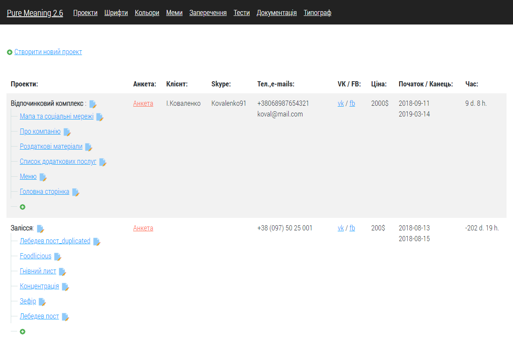
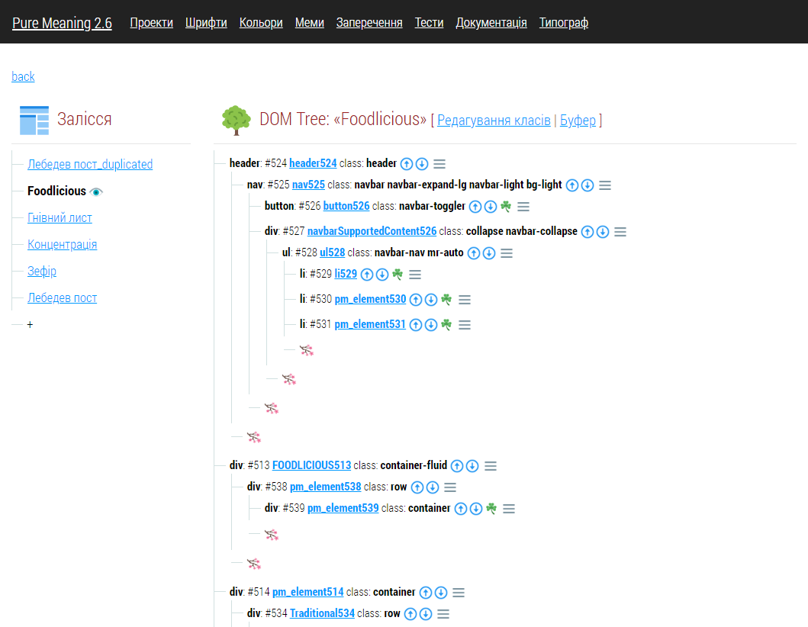
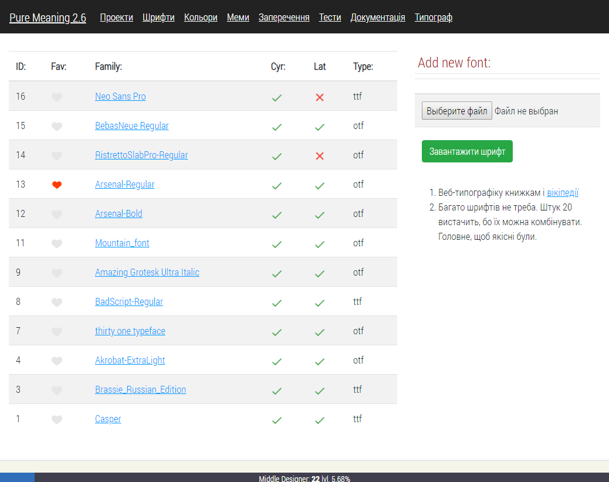
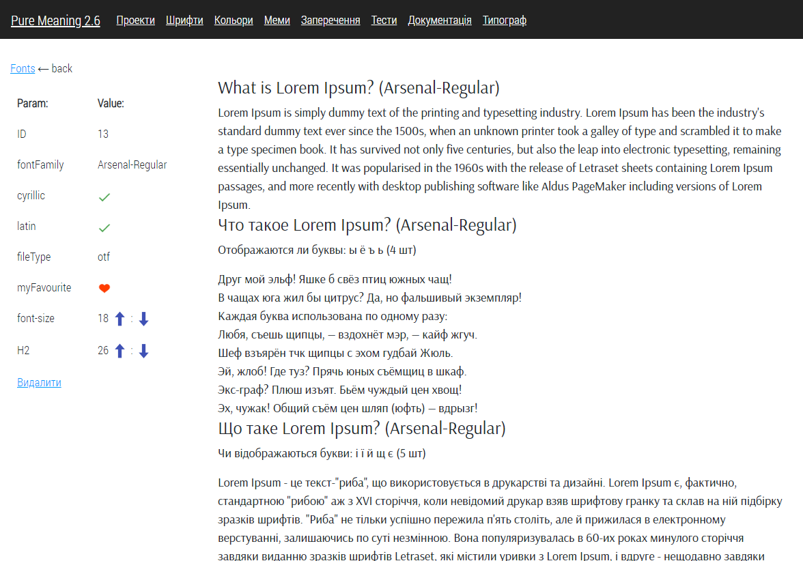
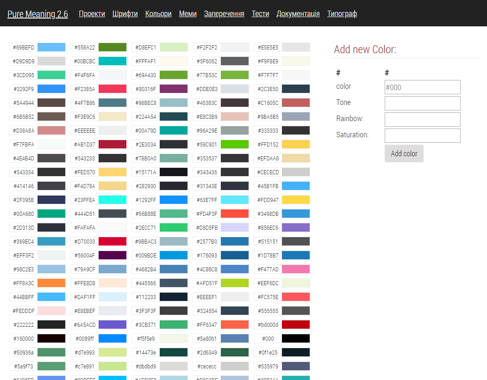

# CRM Pure Meaning v2.5

Я доклав максимум зусиль у розробку цієї CRM-системаи і не пожалкував. 
Побудована вона на моєму фреймворку USP. 
Вона вміє блискавично верстати сторінки завдяки візуальним підказкам і можливості в 1 клік клонувати об'єкти, сторінки, блоки, класи і стилі. При чому буфер обміну працює навіть між різними проектами. 

<b>Це наче Bootstrap на стероїдах.</b>

Я обовязково навчу свою нейромережу із цих сирців генерувати веб-дизайн.

Опис можливостей:
<h1>Введення даних про замовників і проекти:</h1>

<h1>Візуальне відображення структури верстки:</h1>

<h1>Візуальний редактор верстки:</h1>

<h1>Плітра шрифтів:</h1>

<h1>Візуальний редактор шрифтів:</h1>

<h1>Палітра кольорів:</h1>

